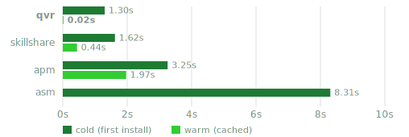
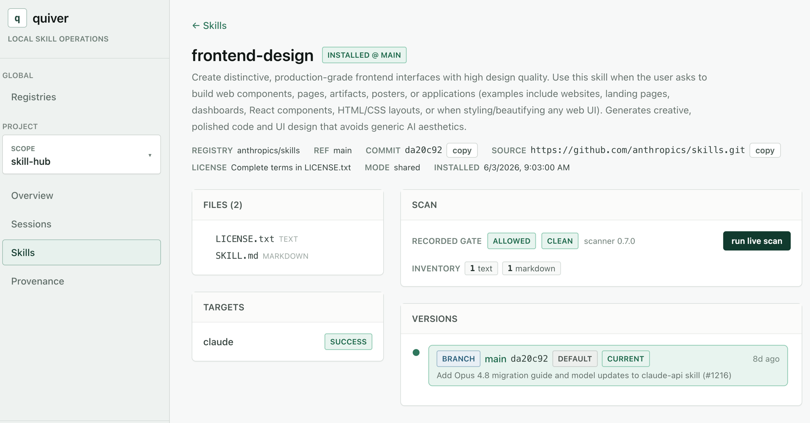

<div align="center">

# quiver(qvr)

An extremely fast skills manager for coding agents, written in Go.

</div>

<p align="center">
  <a href="https://github.com/astra-sh/qvr/releases"></a>
  <a href="https://github.com/astra-sh/qvr/releases"></a>
  <a href="https://github.com/astra-sh/qvr/stargazers"></a>
  <a href="LICENSE"></a>
  <a href="https://github.com/astra-sh/qvr/actions/workflows/ci.yml"></a>
  <a href="go.mod"></a>
</p>

---

## Agent skills are the new packages of AI — it's time to manage them the right way!

A skill is a folder of instructions and scripts your agent loads and executes on
your behalf. That makes it a **dependency**, with all the same questions npm and
uv taught us to ask: Where did it come from? What version is pinned? Has it been
scanned? Can I reproduce this exact set on another machine?

Today most skills are copy-pasted into `.agent/skills/` by hand — unversioned,
unscanned, unattributable. Quiver gives agent skills the lifecycle software
packages already have: a source, a lock, a gate, and an audit trail — with no
server to run and no runtime in the read path.

`qvr` is to agent skills what `uv` is to Python packages: a Git-native,
zero-service CLI to install, version, lint, scan, and govern [agent skills] across
every coding agent — Claude Code, Cursor, Copilot, Codex, Windsurf, anything
that reads skills from a directory.

---

## Why Quiver?

### 1. Built for agentic usage

Developed in **Go** on **native git** — no daemon, no service, no language
runtime in the read path. On a named-subset install from `anthropics/skills`,
`qvr` lands a cold (first-time) install in **~1.3s** and a warm (cached) install
in **~0.02s**:

<div align="center">
  
</div>

Each skill is installed as a **git worktree** — a sparse checkout off a single
bare clone of the source registry. The worktrees are immutable and
**SHA-keyed**, so content is shared by construction: switching versions is a
symlink repoint, not a re-clone, and two projects pinned to the same SHA share
**one copy on disk**.

### 2. `qvr.lock` — provenance, portability, and team collaboration in one file

The lock is the heart of the trust layer, and it's the unit of
**collaboration**: one file, checked into the repo, that every teammate and CI
runner resolves to the byte-identical skill set. It doesn't just pin a SHA; it
records the **verdict of every gate** the skill passed, so the lock _is_ the
audit trail. Each entry carries the resolved commit, a subtree hash of the exact
bytes, the scan report hash + decision, and the provenance of the commit author:

```toml
[skills.frontend-design]
registry     = 'anthropics/skills'
source       = 'https://github.com/anthropics/skills.git'
path         = 'skills/frontend-design'
ref          = 'main'
commit       = 'da20c92503b2e8ff1cf28ca81a0df4673debdbf7'   # resolved SHA
subtreeHash  = 'sha256:21dce9699042…'                       # exact bytes installed
commitAuthor = 'Keith Lazuka <klazuka@anthropic.com>'       # provenance
targets      = ['claude']
```

> [!NOTE]
> **Portability:** the lock travels with the repo. Clone it on any machine, run
> `qvr sync`, and you get the byte-identical, already-vetted skill set — not
> "whatever the registry serves today."
>
> **Provenance & governance:** the lock is a verifiable record.
> `qvr lock verify
> --strict` and `qvr sync --frozen` are CI gates that fail on
> any drift between what's on disk and what the lock attests. Only skills in the
> lock are visible to the agent — no ambient surprises.

Provenance surfaces through `qvr provenance`; invalid signatures always block,
and `qvr trust pin` enforces per-registry commit-author policy. And because the
lock pins **git refs** rather than opaque archives, version control becomes a
first-class feature.

```bash
qvr add code-review@v1.2.0
qvr add code-review@v1.3.0-rc1 --as code-review-rc   # both coexist for A/B
```

### 3. Traceability — the foundation for optimizing and evaluating skills

You can't optimize what you can't measure. Traceability is the foundational
block for **evaluating and improving** skills: once every run is attributable to
the exact skill bytes that produced it, you can tell which version actually
moved the needle and close the authoring loop on evidence rather than guesswork.

Skills are software, so `qvr` gives them the inspection surface software gets.
`qvr audit` captures each agent's native transcript **verbatim** (the lossless
source of truth), then projects it into **OpenTelemetry** spans — Turn / Tool /
Skill — using the GenAI semantic conventions. Spans serialize to standard
**OTLP**, so `qvr audit spans --otlp` feeds any consumer (Jaeger, Tempo,
Honeycomb, an OTel Collector) unchanged. A `skill.*` attribute family tags which
skill each span belongs to and whether that identity was _proven_ from the
artifact the agent actually loaded — making skill attribution a first-class,
queryable dimension of every trace. Pair that proven attribution with the lock's
per-ref pinning and an A/B test stops being anecdotal: each variant's spans
trace back to a specific SHA.

The embedded dashboard (`qvr ui`, baked into the binary) drills from a registry
down to a single skill: its files, agent targets, scan results, version history,
provenance, and recorded sessions.

<div align="center">
  
</div>

---

## Installation

### 1. Prebuilt binary (recommended)

A single self-contained binary with the dashboard baked in — no Go or Node
required.

```bash
# Linux / macOS
curl -fsSL https://raw.githubusercontent.com/astra-sh/qvr/main/install.sh | sh
```

```powershell
# Windows (PowerShell)
irm https://raw.githubusercontent.com/astra-sh/qvr/main/install.ps1 | iex
```

The installer detects your OS/arch, downloads the matching release, verifies its
checksum, and drops `qvr` on your PATH. Tune it with environment variables:

| Variable          | Effect                                          |
| ----------------- | ----------------------------------------------- |
| `QVR_VERSION`     | Install a specific release (e.g. `v0.13.0`).    |
| `QVR_INSTALL_DIR` | Install location (default: a dir on your PATH). |

Verify the install:

```bash
qvr --version
qvr doctor          # sanity-check the environment and any existing installs
```

### 2. From source

For contributors, or to build the latest `main`. Requires **Go 1.25+** and
**Node 20+**.

```bash
git clone https://github.com/astra-sh/qvr.git
cd qvr
make build-all      # builds the React UI, then embeds it into the binary
make install        # -> /usr/local/bin/qvr  (use sudo if needed)
```

> [!NOTE]
> Plain `go install` is intentionally **not** a supported path — it can't run
> the npm build, so it ships without the dashboard. Use the prebuilt binary or
> `make build-all`.

### Updating

Once `qvr` is on your PATH, update it in place — no need to re-run the
installer:

```bash
qvr upgrade                     # download + verify + atomic swap to latest
qvr upgrade --check             # report whether a newer release exists
qvr upgrade --version v0.13.0   # pin a specific release
```

The release binary carries the dashboard embedded, so `qvr upgrade` brings the
UI current too. The download, checksum verify, and swap all happen in-process —
no `curl`/`tar` dependency on any platform.

---

## Quick start

```bash
# register a source — any git clone URL, one skill or fifty
qvr registry add git@github.com:acme/skills.git
qvr registry list

# find skills
qvr search deploy
qvr version list code-review

# add a skill into the current project (scans, then writes qvr.lock)
qvr add code-review                 # latest semver tag, or default branch
qvr add code-review@v1.2.0          # pin a tag, branch, or SHA
qvr sync                            # reconcile the project against qvr.lock
```

Anything under `.claude/skills/` that isn't in `qvr.lock` is hidden from the
agent on `qvr sync`. The lockfile is the only source of truth for what your
agent loads.

---

## Commands

Skills are software, so Quiver runs them through a software lifecycle — and it
**closes**. Authoring a new version isn't a fresh start; it re-enters the same
gate every consumer's install went through.

```
source ─► registry add ─► scan ─► lint ─► add ─► edit ─► publish ─────┐
                          ▲                                           │
                          └──────────────── re-gate ◄─────────────────┘
              (authoring a new version re-enters the gate at scan)
```

### Register a source — `qvr registry add`

Point `qvr` at where skills live. Any git clone URL works — the indexer walks
the repo and finds the skills, whether it holds one skill at its root or fifty
under `skills/`.

```bash
qvr registry add https://github.com/acme-labs/agent-skills   # -> acme-labs/agent-skills
qvr registry list acme-labs/agent-skills                     # skills inside one source
qvr registry update                                          # fetch + rebuild the index
```

### Install a skill — `qvr add`

Add a skill from a registered source into the current project. The skill is
scanned, the lockfile pins the resolved SHA + verdict, and it's symlinked into
every agent dir you target.

```bash
qvr add code-review                 # latest semver tag, or default branch
qvr add code-review@v1.2.0          # pin a tag, branch, or SHA
qvr add --global diagnose           # ambient: available in every session
qvr add code-review --target cursor # install into a specific agent dir
```

### Author & edit — `qvr init` / `qvr edit`

Scaffold a new skill, or eject an installed one from its immutable worktree into
a real, editable directory with its own git history. Other agent targets are
repointed at the edit dir so they stay in sync.

```bash
qvr init my-skill                          # scaffold a spec-valid skeleton
qvr lint my-skill                      # check it against agentskills.io
qvr edit code-review                       # symlink -> real, editable dir
qvr diff code-review                       # local changes vs. HEAD
```

### Publish upstream — `qvr publish`

Push your edits back to the skill's origin. `qvr publish` re-runs the full
lint + scan gate locally and never touches the remote until it passes — closing
the loop.

```bash
qvr publish code-review -m "tighten checklist"      # push HEAD upstream
qvr publish code-review --tag v1.3.0 -m "v1.3.0"    # cut a release, auto un-eject to the tag
qvr publish code-review --fork <git-url> --migrate  # push to your fork and track it
qvr publish code-review --dry-run                   # lint + scan, report target, no push
```

`qvr upgrade <skill>` follows the latest semver tag; `qvr switch <skill> <ref>`
flips to any ref without branching.

### Audit & trace — `qvr audit`

```bash
qvr audit sessions                  # recorded skill sessions
qvr audit logs                      # turn / tool / skill events
qvr audit spans --otlp              # export OTLP for Jaeger, Tempo, Honeycomb, …
qvr audit ingest <transcript|dir>   # record an existing transcript with no live hook
qvr audit gc                        # drop sessions that never used a skill
```

### Inspect & verify

```bash
qvr list                    # skills in the project lock (--all unions global)
qvr info <skill>            # frontmatter, refs, targets
qvr status [skill...]       # per-skill state: clean / dirty / drift
qvr provenance <skill>      # where it came from, signature + author trust
qvr outdated                # ls-remote vs. pinned SHAs
qvr doctor                  # broken installs, orphan artifacts (--strict to fail)
qvr lock verify --strict    # CI gate: every entry is verifiably the recorded state
```

### Garbage-collect the worktree store

The SHA-keyed worktree store under `~/.quiver/worktrees/` is _derived_ state —
`qvr sync` rebuilds any missing worktree from the lock — so it GCs freely (verbs
mirror `uv cache`):

```bash
qvr cache list              # reachable + orphan worktrees with sizes
qvr cache prune             # drop worktrees no project lock references
qvr cache clean             # wipe the store and the registry index cache
```

### Dashboard — `qvr ui`

```bash
qvr ui                      # serve the local dashboard (embedded in the binary)
```

---

## How it's wired

**Storage**: bare git clones → per-skill worktrees (sparse checkout) → symlinks
into agent dirs.

```
 ~/.quiver/                              shared worktree store + index cache
 ├── config.yaml                         registered sources (URLs + names)
 ├── qvr.lock                            global ambient lock (--global lane)
 ├── registries/<org>/<repo>.git/        bare clones (source of truth)
 ├── worktrees/<org>/<repo>/<skill>/<sha7>/   immutable, SHA-keyed, shared
 └── cache/index/<name>.json             TTL'd registry index cache

 <project>/
 ├── qvr.lock                            project lock — source of truth
 ├── .claude/skills/<skill>   -> symlink into ~/.quiver/worktrees/
 ├── .cursor/rules/<skill>    -> symlink into ~/.quiver/worktrees/
 └── .github/copilot/skills/  -> symlink into ~/.quiver/worktrees/
```

### Agent targets

| Target   | Local dir                 | Global dir                  |
| -------- | ------------------------- | --------------------------- |
| claude   | `.claude/skills/`         | `~/.claude/skills/`         |
| cursor   | `.cursor/rules/`          | `~/.cursor/rules/`          |
| copilot  | `.github/copilot/skills/` | `~/.github/copilot/skills/` |
| codex    | `.codex/skills/`          | `~/.codex/skills/`          |
| windsurf | `.windsurf/skills/`       | `~/.windsurf/skills/`       |
| project  | `.agent/skills/`          | `~/.agent/skills/`          |

---

## Standards

Quiver builds on open standards rather than inventing its own formats.

- **Skills follow [agentskills.io](https://agentskills.io/specification).** A
  skill is a directory with a `SKILL.md` whose YAML frontmatter carries `name` +
  `description` (plus optional `license`, `compatibility`, `allowed-tools`,
  `metadata`). Quiver's parser (`pkg/skillspec`) and linter enforce the spec —
  nothing Quiver-proprietary is required to author a skill.
- **Traces follow
  [OpenTelemetry](https://opentelemetry.io/docs/specs/semconv/gen-ai/).**
  Captures are stored verbatim and _projected_ into OTLP spans, stamped with a
  `deriver_version` so an improved deriver can re-run over old captures
  (`qvr audit rederive`) without re-capturing.

---

## Documentation

In-depth docs live under [`documentation/`](documentation/):

- [Architecture](documentation/architecture.md) — storage layout, hot/warm/cold
  paths
- [Skill format](documentation/skill-format.md) — `SKILL.md` frontmatter and
  contract
- [Registry format](documentation/registry-format.md) — repo layouts the indexer
  accepts
- [Config reference](documentation/config-reference.md) —
  `~/.quiver/config.yaml` keys
- Guides: [getting started](documentation/guides/getting-started.md) ·
  [creating a skill](documentation/guides/creating-a-skill.md) ·
  [creating a registry](documentation/guides/creating-a-registry.md) ·
  [agent integration](documentation/guides/agent-integration.md) ·
  [team workflows](documentation/guides/team-workflows.md)

---

<div align="center">

Built and maintained by [SRP](https://github.com/raks097) · MIT licensed ·
Issues and PRs welcome

</div>
